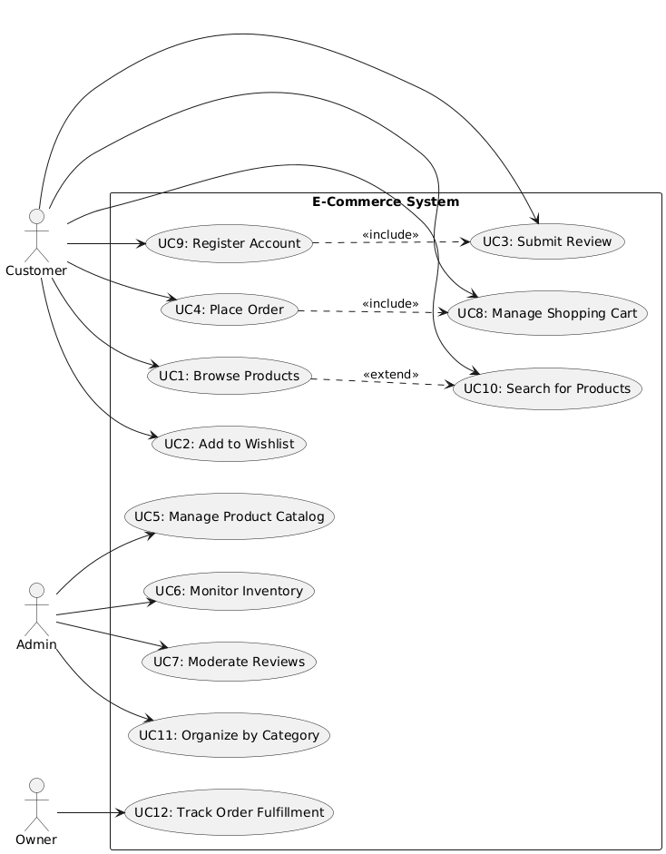

Analysis Page for features and use cases in the MotherTreeCrafts project, as well as a linked use case diagram for current use cases.

Main bulk of the features and use cases come from the nouns and verbs analysis, which will alter and change as the project is revised and refactored,
so this page will be updated as changes happen to other analysis pages.

# Features and Use Cases

## Features
- Feature 1: Product catalog management
- Feature 2: Inventory tracking
- Feature 3: User account management
- Feature 4: Product review system
- Feature 5: Wishlist management
- Feature 6: Shopping cart processing
- Feature 7: Order management
- Feature 8: Product categorization
- Feature 9: User authentication
- Feature 10: Product search and filtering

## Brief Use Cases

### UC1: Customer browses products
- Primary Actor: Customer
- Goal: Find products to purchase

### UC2: Customer adds product to wishlist
- Primary Actor: Customer
- Goal: Save products for future consideration

### UC3: Customer submits product review
- Primary Actor: Customer
- Goal: Share feedback about purchased product

### UC4: Customer places order
- Primary Actor: Customer
- Goal: Purchase selected products

### UC5: Admin manages product catalog
- Primary Actor: Admin
- Goal: Maintain accurate product information

### UC6: Admin monitors inventory levels
- Primary Actor: Admin
- Goal: Ensure products remain in stock

### UC7: Admin moderates product reviews
- Primary Actor: Admin
- Goal: Ensure review quality and appropriateness

### UC8: Customer manages shopping cart
- Primary Actor: Customer
- Goal: Prepare items for checkout

### UC9: Customer registers account
- Primary Actor: Customer
- Goal: Create account for purchases and saved preferences

### UC10: Customer searches for products
- Primary Actor: Customer
- Goal: Locate specific products quickly

### UC11: Admin organizes products by category
- Primary Actor: Admin
- Goal: Improve product discoverability

### UC12: Owner tracks order fulfillment
- Primary Actor: Owner
- Goal: Monitor business operations and sales

## Use Case Traceability

| Use Case | Feature(s) |
|---|---|
| UC1: Customer browses products | Feature 1, Feature 10 |
| UC2: Customer adds product to wishlist | Feature 5 |
| UC3: Customer submits product review | Feature 4 |
| UC4: Customer places order | Feature 6, Feature 7 |
| UC5: Admin manages product catalog | Feature 1 |
| UC6: Admin monitors inventory levels | Feature 2 |
| UC7: Admin moderates product reviews | Feature 4 |
| UC8: Customer manages shopping cart | Feature 6 |
| UC9: Customer registers account | Feature 3, Feature 9 |
| UC10: Customer searches for products | Feature 1, Feature 10 |
| UC11: Admin organizes products by category | Feature 8 |
| UC12: Owner tracks order fulfillment | Feature 7 |

## Use Case Diagram
Include your diagram image below.

