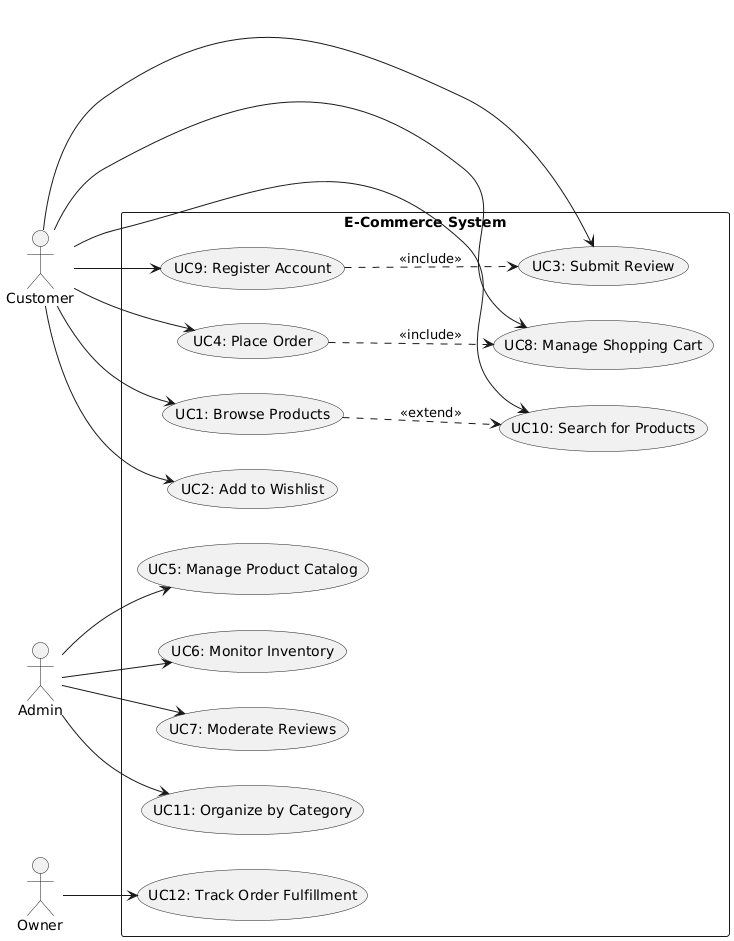

Analysis Page for features and use cases in the MotherTreeCrafts project, as well as a linked use case diagram for current use cases.

Main bulk of the features and use cases come from the nouns and verbs analysis, which will alter and change as the project is revised and refactored,
so this page will be updated as changes happen to other analysis pages.

# Features and Use Cases

## Features
- Feature 1: Product catalog management
- Feature 2: Inventory tracking
- Feature 3: User account management
- Feature 4: Product review system
- Feature 5: Wishlist management
- Feature 6: Shopping cart processing
- Feature 7: Order management
- Feature 8: Product categorization
- Feature 9: User authentication
- Feature 10: Product search and filtering

## Brief Use Cases

### UC1: Customer browses products
- Primary Actor: Customer
- Goal: Find products to purchase

### UC2: Customer adds product to wishlist
- Primary Actor: Customer
- Goal: Save products for future consideration

### UC3: Customer submits product review
- Primary Actor: Customer
- Goal: Share feedback about purchased product

### UC4: Customer places order
- Primary Actor: Customer
- Goal: Purchase selected products

### UC5: Admin manages product catalog
- Primary Actor: Admin
- Goal: Maintain accurate product information

### UC6: Admin monitors inventory levels
- Primary Actor: Admin
- Goal: Ensure products remain in stock

### UC7: Admin moderates product reviews
- Primary Actor: Admin
- Goal: Ensure review quality and appropriateness

### UC8: Customer manages shopping cart
- Primary Actor: Customer
- Goal: Prepare items for checkout

### UC9: Customer registers account
- Primary Actor: Customer
- Goal: Create account for purchases and saved preferences

### UC10: Customer searches for products
- Primary Actor: Customer
- Goal: Locate specific products quickly

### UC11: Admin organizes products by category
- Primary Actor: Admin
- Goal: Improve product discoverability

### UC12: Owner tracks order fulfillment
- Primary Actor: Owner
- Goal: Monitor business operations and sales

## Use Case Traceability

| Use Case | Feature(s) |
|---|---|
| UC1: Customer browses products | Feature 1, Feature 10 |
| UC2: Customer adds product to wishlist | Feature 5 |
| UC3: Customer submits product review | Feature 4 |
| UC4: Customer places order | Feature 6, Feature 7 |
| UC5: Admin manages product catalog | Feature 1 |
| UC6: Admin monitors inventory levels | Feature 2 |
| UC7: Admin moderates product reviews | Feature 4 |
| UC8: Customer manages shopping cart | Feature 6 |
| UC9: Customer registers account | Feature 3, Feature 9 |
| UC10: Customer searches for products | Feature 1, Feature 10 |
| UC11: Admin organizes products by category | Feature 8 |
| UC12: Owner tracks order fulfillment | Feature 7 |

## Use Case Diagram
Include your diagram image below.

## Detailed Use Cases

### UC1: Customer browses products
**Primary Actor:** Customer  
**Goal:** Find products to purchase  
**Preconditions:**
- Product catalog contains at least one active product
- Products are categorized and available for viewing

**Success Outcome:**
- Customer views product information including name, description, price, and availability
- Product catalog is displayed with accurate inventory status

**Main Flow**
1. Customer requests to view the product catalog
2. System retrieves all active products
3. System displays products with basic information (name, price, thumbnail image)
4. Customer selects a specific product to view details
5. System retrieves complete product information including description, images, inventory status, and category
6. System displays detailed product information to customer

**Alternate Flow**
- A1: No products available
  - System displays message indicating catalog is empty
  - Use case ends
- A2: Product is out of stock
  - System displays product information but marks it as unavailable
  - System prevents adding product to cart
- A3: Customer filters by category
  - System retrieves only products matching selected category
  - Continue at step 3

---

### UC2: Customer adds product to wishlist
**Primary Actor:** Customer  
**Goal:** Save products for future consideration  
**Preconditions:**
- Customer has an active account
- Customer is authenticated
- Product exists and is active in catalog

**Success Outcome:**
- Product is added to customer's wishlist
- Customer can view and manage wishlist items

**Main Flow**
1. Customer views product details
2. Customer requests to add product to wishlist
3. System verifies customer authentication
4. System checks if product already exists in customer's wishlist
5. System adds product to customer's wishlist with current timestamp
6. System confirms product added to wishlist
7. Customer can continue browsing or view wishlist

**Alternate Flow**
- A1: Customer not authenticated
  - System redirects to authentication
  - After authentication, continue at step 4
- A2: Product already in wishlist
  - System notifies customer product is already saved
  - Use case ends
- A3: Customer requests to remove product from wishlist
  - System removes product from wishlist
  - System confirms removal
  - Use case ends

---

### UC3: Customer submits product review
**Primary Actor:** Customer  
**Goal:** Share feedback about purchased product  
**Preconditions:**
- Customer has an active account
- Customer is authenticated
- Customer has previously purchased the product
- Customer has not already reviewed this product

**Success Outcome:**
- Review is saved with rating, comment, and timestamp
- Review is associated with customer and product
- Review is pending moderation before public display

**Main Flow**
1. Customer navigates to purchased product
2. Customer requests to submit a review
3. System verifies customer has purchased the product
4. System verifies customer has not already reviewed this product
5. Customer provides rating (1-5 scale) and optional written comment
6. System validates rating and comment (if provided)
7. System saves review with pending status
8. System associates review with customer and product
9. System confirms review submission and notifies that it's pending approval

**Alternate Flow**
- A1: Customer has not purchased product
  - System denies review submission
  - System notifies customer only purchasers can review
  - Use case ends
- A2: Customer already reviewed this product
  - System displays existing review
  - System allows customer to edit or delete existing review
- A3: Review comment violates content policy
  - System rejects review submission
  - System provides feedback on policy violation
  - Customer can modify and resubmit

---

### UC4: Customer places order
**Primary Actor:** Customer  
**Goal:** Purchase selected products  
**Preconditions:**
- Customer has an active account
- Customer is authenticated
- Customer has items in shopping cart
- All cart items have sufficient inventory

**Success Outcome:**
- Order is created with unique order number
- Order includes all cart items, quantities, prices, and totals
- Inventory is reserved for ordered items
- Shopping cart is cleared
- Customer receives order confirmation

**Main Flow**
1. Customer requests to proceed to checkout
2. System validates all cart items have sufficient inventory
3. System calculates order totals (subtotal, tax, shipping if applicable)
4. Customer provides or confirms shipping address
5. Customer provides or confirms payment information
6. System validates payment information
7. System creates order with pending status
8. System reserves inventory for ordered items
9. System processes payment
10. System updates order status to confirmed
11. System clears customer's shopping cart
12. System generates order confirmation with order number
13. System notifies customer of successful order placement

**Alternate Flow**
- A1: Cart is empty
  - System prevents checkout
  - System directs customer to continue shopping
  - Use case ends
- A2: Item has insufficient inventory
  - System notifies customer which items are unavailable
  - System removes out-of-stock items from cart or allows quantity adjustment
  - Continue at step 2
- A3: Payment processing fails
  - System rolls back inventory reservation
  - System notifies customer of payment failure
  - Customer can update payment information and retry
- A4: Customer cancels checkout
  - System retains cart items
  - Use case ends

---

### UC5: Admin manages product catalog
**Primary Actor:** Admin  
**Goal:** Maintain accurate product information  
**Preconditions:**
- Admin has valid administrative credentials
- Admin is authenticated with administrative privileges

**Success Outcome:**
- Product catalog is updated with accurate information
- Changes are immediately reflected in customer-facing catalog
- Product history is maintained for audit purposes

**Main Flow**
1. Admin requests to manage product catalog
2. System displays list of all products (active and inactive)
3. Admin selects a product to modify or requests to create new product
4. System displays product form with current data (or empty for new product)
5. Admin updates product information (name, description, price, category, inventory, images)
6. System validates all required fields and data formats
7. System saves product information
8. System updates product last-modified timestamp
9. System confirms changes saved successfully

**Alternate Flow**
- A1: Admin creates new product
  - System assigns unique product ID
  - System sets creation timestamp
  - Continue at step 7
- A2: Admin deactivates product
  - System marks product as inactive
  - System removes product from customer-facing catalog
  - System retains product data for historical orders
- A3: Admin reactivates product
  - System marks product as active
  - System verifies inventory quantity
  - System adds product back to catalog
- A4: Validation fails
  - System displays specific validation errors
  - Admin corrects errors and resubmits
- A5: Admin uploads product images
  - System validates image format and size
  - System stores images and associates with product
  - Continue at step 6

---

### UC6: Admin monitors inventory levels
**Primary Actor:** Admin  
**Goal:** Ensure products remain in stock  
**Preconditions:**
- Admin has valid administrative credentials
- Admin is authenticated with administrative privileges
- Products exist in catalog with inventory tracking

**Success Outcome:**
- Admin views current inventory levels across all products
- Admin identifies products with low or zero inventory
- Admin updates inventory quantities as needed

**Main Flow**
1. Admin requests inventory report
2. System retrieves current inventory levels for all products
3. System displays products with current quantity, last updated timestamp
4. System highlights products below reorder threshold
5. Admin identifies product requiring inventory update
6. Admin enters new inventory quantity
7. System validates quantity is non-negative
8. System updates inventory level
9. System records inventory transaction with timestamp and admin ID
10. System confirms inventory updated

**Alternate Flow**
- A1: Admin filters inventory by category
  - System displays only products in selected category
  - Continue at step 4
- A2: Admin views inventory history
  - System displays all inventory transactions for selected product
  - Shows previous quantities, adjustments, and timestamps
- A3: Product inventory reaches zero
  - System automatically marks product as out of stock
  - System prevents customer orders for that product
- A4: Admin sets reorder threshold
  - System saves threshold value for product
  - System will flag product when inventory falls below threshold

---

### UC7: Admin moderates product reviews
**Primary Actor:** Admin  
**Goal:** Ensure review quality and appropriateness  
**Preconditions:**
- Admin has valid administrative credentials
- Admin is authenticated with administrative privileges
- Reviews exist in pending or published status

**Success Outcome:**
- Reviews are approved or rejected based on content policy
- Approved reviews are visible to customers
- Rejected reviews are flagged with reason
- Review moderation history is maintained

**Main Flow**
1. Admin requests pending reviews
2. System retrieves all reviews with pending status
3. System displays reviews with product name, customer, rating, comment, and submission date
4. Admin selects review to moderate
5. Admin reads review content
6. Admin approves review
7. System updates review status to approved
8. System makes review publicly visible
9. System records moderation action with timestamp and admin ID
10. System confirms review approved

**Alternate Flow**
- A1: Admin rejects review
  - Admin provides rejection reason (inappropriate content, spam, etc.)
  - System updates review status to rejected
  - System stores rejection reason
  - System notifies customer of rejection
- A2: Admin views all reviews for specific product
  - System displays all reviews (pending, approved, rejected) for product
  - Admin can moderate from this view
- A3: Admin removes previously approved review
  - System updates review status to removed
  - System hides review from public view
  - System records removal reason and timestamp
- A4: No pending reviews
  - System displays message indicating no reviews need moderation
  - Use case ends

---

### UC8: Customer manages shopping cart
**Primary Actor:** Customer  
**Goal:** Prepare items for checkout  
**Preconditions:**
- Customer session is active (authentication optional)
- Product catalog is accessible

**Success Outcome:**
- Shopping cart contains selected products with desired quantities
- Cart displays accurate pricing and totals
- Cart items are available for checkout

**Main Flow**
1. Customer views product details
2. Customer specifies quantity and requests to add product to cart
3. System verifies product is active and has sufficient inventory
4. System adds product to cart or updates quantity if already present
5. System calculates cart subtotal
6. System confirms item added to cart
7. Customer continues shopping or views cart
8. When viewing cart, system displays all items with name, quantity, unit price, and line total
9. System calculates and displays cart totals

**Alternate Flow**
- A1: Product has insufficient inventory
  - System notifies customer of available quantity
  - System allows customer to add available quantity or cancel
- A2: Customer updates item quantity in cart
  - System validates new quantity against inventory
  - System updates cart item quantity
  - System recalculates totals
- A3: Customer removes item from cart
  - System removes item from cart
  - System recalculates totals
- A4: Customer clears entire cart
  - System removes all items from cart
  - Use case ends
- A5: Cart is empty
  - System displays message encouraging customer to shop
  - Use case ends
- A6: Authenticated customer's cart persists across sessions
  - System saves cart to customer account
  - System restores cart on next login

---

### UC9: Customer registers account
**Primary Actor:** Customer  
**Goal:** Create account for purchases and saved preferences  
**Preconditions:**
- Customer does not have an existing account
- System is accepting new registrations

**Success Outcome:**
- Customer account is created with unique identifier
- Customer credentials are securely stored
- Customer is authenticated and can access account features

**Main Flow**
1. Customer requests to register new account
2. System displays registration form
3. Customer provides required information (email, password, name)
4. System validates email format
5. System verifies email is not already registered
6. System validates password meets security requirements
7. System creates customer account
8. System securely hashes and stores password
9. System generates unique customer ID
10. System authenticates customer
11. System confirms successful registration
12. Customer is redirected to account or previous page

**Alternate Flow**
- A1: Email already registered
  - System notifies customer email is already in use
  - System offers password reset option
  - Use case ends
- A2: Password does not meet requirements
  - System displays specific password requirements
  - Customer provides new password
  - Continue at step 6
- A3: Customer provides optional information
  - System saves additional profile data (phone, address preferences)
  - Continue at step 7
- A4: Email validation required
  - System sends verification email with unique token
  - System marks account as pending verification
  - Customer confirms email via token link
  - System activates account

---

### UC10: Customer searches for products
**Primary Actor:** Customer  
**Goal:** Locate specific products quickly  
**Preconditions:**
- Product catalog contains searchable products
- Search functionality is available

**Success Outcome:**
- System returns relevant products matching search criteria
- Customer can view and navigate to product details from results
- Search results are ranked by relevance

**Main Flow**
1. Customer enters search query (keywords, product name, description terms)
2. System validates search query is not empty
3. System searches product catalog (names, descriptions, categories)
4. System retrieves matching products
5. System ranks results by relevance
6. System displays search results with product thumbnails, names, and prices
7. Customer views results and selects product for details

**Alternate Flow**
- A1: No products match search query
  - System displays message indicating no results found
  - System suggests alternative searches or browse categories
  - Use case ends
- A2: Customer refines search with filters
  - System applies additional criteria (category, price range, availability)
  - System updates search results
  - Continue at step 6
- A3: Customer sorts search results
  - System reorders results by selected criteria (price, name, newest)
  - Continue at step 6
- A4: Search query too broad
  - System returns limited number of results
  - System suggests filtering or more specific terms

---

### UC11: Admin organizes products by category
**Primary Actor:** Admin  
**Goal:** Improve product discoverability  
**Preconditions:**
- Admin has valid administrative credentials
- Admin is authenticated with administrative privileges
- Products exist in catalog

**Success Outcome:**
- Products are associated with appropriate categories
- Category structure is logical and navigable
- Category assignments improve customer browsing experience

**Main Flow**
1. Admin requests category management
2. System displays existing categories and products
3. Admin creates new category or selects existing category
4. Admin provides category information (name, description, parent category if applicable)
5. System validates category name is unique
6. System saves category
7. Admin assigns products to category
8. System associates products with category
9. System updates product catalog organization
10. System confirms category changes saved

**Alternate Flow**
- A1: Admin creates category hierarchy
  - System allows nesting categories under parent categories
  - System validates hierarchy depth and relationships
  - Continue at step 6
- A2: Admin moves products between categories
  - System updates product-category associations
  - System maintains product visibility in catalog
- A3: Admin renames category
  - System validates new name is unique
  - System updates category name
  - System preserves product associations
- A4: Admin deletes category
  - System checks if category has associated products
  - If products exist, system requires reassignment or confirmation
  - System removes category from structure
- A5: Category name already exists
  - System notifies admin of duplicate
  - Admin provides different name or cancels
  - Retry at step 4

---

### UC12: Owner tracks order fulfillment
**Primary Actor:** Owner  
**Goal:** Monitor business operations and sales  
**Preconditions:**
- Owner has valid owner credentials
- Owner is authenticated with owner privileges
- Orders exist in system

**Success Outcome:**
- Owner views comprehensive order information
- Owner identifies orders requiring fulfillment action
- Owner monitors business performance metrics

**Main Flow**
1. Owner requests order management dashboard
2. System retrieves all orders with current status
3. System displays orders sorted by date with order number, customer, status, and total
4. System highlights orders requiring attention (pending fulfillment, issues)
5. Owner selects specific order for details
6. System displays complete order information (items, quantities, customer, shipping address, payment status)
7. Owner updates order status (processing, shipped, completed)
8. System records status change with timestamp
9. System confirms order updated
10. System notifies customer of status change if applicable

**Alternate Flow**
- A1: Owner filters orders by status
  - System displays only orders matching selected status
  - Continue at step 4
- A2: Owner filters orders by date range
  - System displays orders within specified timeframe
  - Continue at step 4
- A3: Owner views sales metrics
  - System calculates total revenue, order count, average order value
  - System displays metrics by time period
- A4: Owner marks order as shipped
  - System prompts for tracking information
  - System updates order status to shipped
  - System sends shipping notification to customer with tracking details
- A5: Order has issue (payment failed, inventory shortage)
  - System flags order with issue status
  - Owner reviews and takes corrective action
  - Owner updates order status or cancels order
- A6: Owner searches orders by customer or order number
  - System retrieves matching orders
  - Continue at step 5